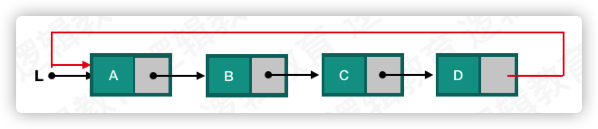

#  单向循环链表


单向循环链表表的尾结点指针域指向首元节点, 从而形成一个闭合的链表. 用图片表达是这样的:



## 单向链表的数据结构设计

```c
// 数据结构的定义
typedef struct Node {
    Element data;		// 数据域
    struct Node *next;	// 指针域
}Node;

typedef struct Node * LinkList;
```

## 创建

在创建单向循环链表考虑两种情况：

1. 链表的还没有创建
	* 创建首元节点，将首元节点next指向本身。
2. 链表已经被创建，将元素插入到表尾。
	* 找到尾结点
	* 创建新的节点
	* 将新建节点的next指向尾结点的next
	* 将尾结点的next指向新建节点

代码如下：

```c
Status CreateList(LinkList *l) {
   
    int a;
    Node *target, *temp = NULL;
    
    printf("输入节点的值,输入0结束.\n");
    
    while (1) {
        
        scanf("%d", &a);
        
        if (a == 0) break;
        
        if (*l == NULL) { 
       		// 1 链表还未创建
            *l = malloc(sizeof(Node));
            if (*l == NULL) return ERROR;
            (*l)->data = a;
            (*l)->next = *l;
        } else {	  
        	// 2 链表已经存在
            // 查找尾结点
            for (target = *l; target->next != *l; target = target->next);
            temp = malloc(sizeof(Node));
            temp->data = a;
            temp->next = target->next;
            target->next = temp;
        }
    }
    
    return OK;
}
```

上面代码已经能够完成单向循环链表的创建了，但是还有可以优化的地方。 在链表的尾部插入新的节点时候，我们使用 `for` 循环的方式来获取查找尾结点，这样的方式会增加时间复杂度，我们可以使用尾插法的方式，添加一个指针始终指向尾结点。

优化的代码如下：

```c
Status CreateList(LinkList *l) {
    
    int a;
    Node *tail = NULL, *temp = NULL;
    
    printf("输入节点的值,输入0结束.\n");
    
    while (1) {
        
        scanf("%d", &a);
        
        if (a == 0) break;
        
        if (*l == NULL) {
            tail = malloc(sizeof(Node));
            if (!tail) return ERROR;
            tail->data = a;
            tail->next = tail;
            *l = tail;
        } else {
            temp = malloc(sizeof(Node));
            temp->data = a;
            temp->next = tail->next;
            tail->next = temp;
            tail = temp;
        }
    }
    
    return OK;
}
```

在上面代码中我们添加了一个临时指针变量 `tail` 始终指向链表的尾结点。


## 插入

插入节点也要考虑两种情况，当插入位置是首元节点时，和插入其他的位置时。

如果插入位置时首元节点，实现步骤如下：

1. 创建插入的节点
2. 找到尾结点
3. 将尾结点的next指向插入节点
4. 将插入节点next指向首元节点
5. 将指向首元结点的指针指向插入的节点

如他位置插入的实现步骤如下：

1. 找到插入节点的位置，即插入位置的前一个节点，如果超过链表的长度则插入到链表尾部
2. 将插入节点的next指向插入节点前一个节点的next
3. 插入前一个节点的next指向插入节点

实现代码如下：

```c
Status ListInsert(LinkList *l, int i, Element e) {
    
    if (*l == NULL || i < 0) return ERROR;
    
    Node *p = NULL;
    Node *target = NULL;
    int j;
    
    if (i == 0) {
        // 如果插入位置是一个,需要特殊处理.
        
        // 1.创建需要插入的节点
        // 2.找到tail节点
        // 3.将tail->next 指向 插入的节点
        // 4.将查入节点的next 指向 首元结点
        // 5.将首元节点指针指向插入的节点
        
        // 1
        p = malloc(sizeof(Node));
        if (!p) return ERROR;
        p->data = e;
        // 2
        for (target = *l; target->next != *l; target = target->next);
        // 3
        target->next = p;
        // 4
        p->next = *l;
        // 5
        *l = p;
    } else {
        // 其他位置插入
        
        // 1.找到i-1的节点, 如果超过链表的长度, 则插入到尾部
        // 2.创建新的节点
        // 3.新节点的next指向 i-1节点的next
        // 4.i-1节点的next指向新节点
        
        // 1
        for (j = 0,  target = *l; target->next != *l && j != i - 1; target = target->next, j++);
        // 2
        p = malloc(sizeof(Node));
        if (!p) return ERROR;
        p->data = e;
        // 3
        p->next = target->next;
        // 4
        target->next = p;
    }
    
    return OK;
}
```

## 删除

单向循环链表删除节点也要考虑删除的是否是首元节点两种情况，如果删除的是首元节点：

1. 若链表中只剩首元节点，释放首元节点，将指向首元节点的指针指向NULL
2. 若链表中还有多个节点
3. 找到尾结点
4. 将尾结点的next指向首元节点的next
5. 将首元节点的指针指向首元节点的next
6. 释放首元节点

如果删除的是非首元节点的位置：

1. 找到删除节点的前一个，如果删除节点位置大于链表的长度，则删除表尾的元素。
2. 删除节点的前一个节点指向删除节点的next
3. 释放删除节点

代码如下：

```c
Status ListDelete(LinkList *l, int i) {
    
    // 循环链表删除也要考虑两种情况
    // 1. 删除节点是首元节点
    // 2. 删除节点非首元节点
    
    if (*l == NULL || i < 0) return ERROR;
    
    Node *temp, *target = NULL;
    int j;
    
    if (i == 0) {
        
        // 如果只剩下首元节点
        if ((*l)->next == *l) {
            free(*l);
            *l = NULL;
            return OK;
        }
        
        // 1.找到尾结点
        // 2.保存首元节点 为了释放内存
        // 3.将尾结点的next指向首元节点的next;
        // 4.将首元节点的指针指向首元节点的next
        // 5.释放首元节点
        
        // 1
        for (target = *l; target->next != *l; target = target->next);
        // 2
        temp = *l;
        // 3
        target->next = temp->next;
        // 4
        *l = temp->next;
        // 5
        free(temp);
    } else {
        
        // 1. 找到删除节点的前一个节点 target
        // 2. target->next 指向 删除节点的next
        // 3. 释放删除的节点
        
        // 1
        for (target = *l, j = 0; target->next != target && j != i - 1; target = target->next, j++) {
            temp = target->next;
            // 2
            target->next = temp->next;
            // 3
            free(temp);
        }
    }
    
    return OK;
}
```


## 查找


```c
int FindValue(LinkList l, int value) {
    
    if (l == NULL) return -1;
    
    int i = 0;
    Node * p = l;
    
    // 遍历链表，当查找到目标或遍历到尾结点跳出循环
    while (p->data != value && p->next != l) {
        i++;
        p = p->next;
    }
    
    // 如果命中目标 返回index， 未命中返回-1
    if (p->data == value) {
        return i;
    }
    
    return -1;
}


```

## 约瑟夫杀人游戏

> 待补充。。。


