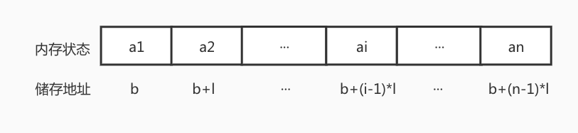
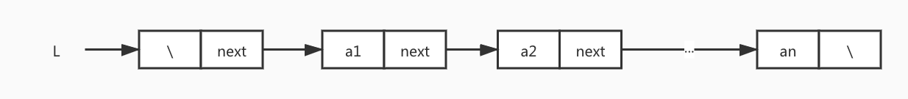
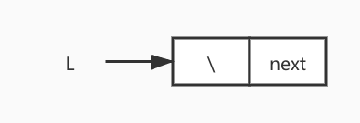
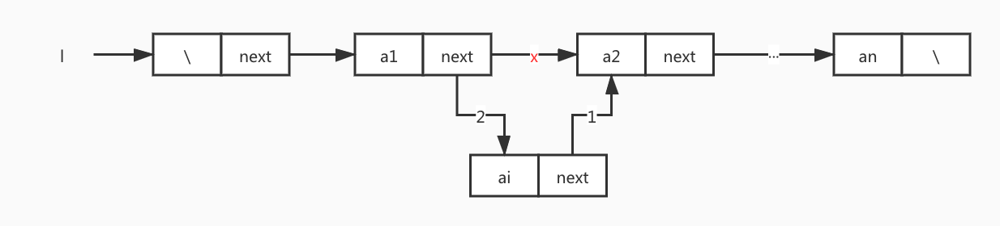
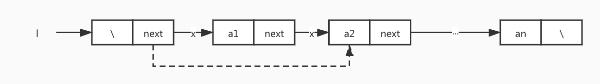

#  线性表


## 线性表的顺序表示和实现

线性表的顺序表示是指用一组地址连续的储存单元依次储存线性表的数据元素。

我们通常将线性表的顺序储存结构称作顺序表。他的特点是，相邻的元素他们的储存位置也是相邻的。因此只要确定了储存线性表的起始位置，那么线性表的任一数据元素都能够随机存取。

他们的逻辑结构和物理存储结构，有如下关系：



### 顺序表的数据结构定义

```c
#define MAX_SIZE 100

typedef int Element;
typedef int Status;

// 结构
typedef struct {
    Element * data;
    int length;
}SqList;
```

使用结构体 `SqList` 表示顺序表， `data` 用来储存数据， `length` 表示当前顺序表的长度， `MAX_SIZE` 表示顺序表最大的存储空间。


### 初始化

```c
// 初始化 顺序表
Status InitList(SqList *l) {
    // 入参判断
    if (l == NULL) return ERROR;
    // 分配内存
    l->data = (int *)malloc(sizeof(Element) * MAX_SIZE);
    // 内存开辟失败 返回error
    if (!l->data) return ERROR;
    l->length = 0;
    return OK;
}
```

### 插入

假设我们有顺序表如下：

	{ 99, 100, 3, 12, 14, 23, 15, 22, 19, 10 }
	                 ↑
	               插入20

我们在 `12` 和 `14` 之间插入 `20`:

	{ 99, 100, 3, 12, 20, 14, 23, 15, 22, 19, 10 }

对比差别，我们需要将插入元素位置后的元素右移一位。如果插入的位置是表尾，直接插入就行。

代码如下：

```c
/// 顺序表插入 index从0开始计算
/// @param l 操作的顺序表
/// @param i 插入位置
/// @param e 插入元素
Status ListInsert(SqList *l, int i, Element e) {
    
    // 1. 入参合法判断
    // 2. 储存空间是否已满
    // 3. 插入位置是否在表尾
    // 3.1 在表尾直接插入
    // 3.2 不在表尾,插入位置之后的元素 包含插入位置 向右移动一位.将元素放在i
    // 4.长度+1
    
    // 1.
    if (i < 0 || i > l->length) return ERROR;
    // 2.
    if (l->length == MAX_SIZE) return ERROR;
    // 3.2
    if (i < l->length) {
        for (int j = l->length - 1; j >= i ; j--) {
            l->data[j + 1] = l->data[j];
        }
    }
    
    // 将新元素放在第i个位置上
    l->data[i] = e;
    // 长度 +1
    l->length++;
    
    return OK;
}

```

### 删除

如果删除元素的位置在表尾：

删除前：
	
	{ 99, 100, 3, 12, 14, 23, 15, 22, 19, 10 }
	                                       *
	                                     Delete

删除后：

	{ 99, 100, 3, 12, 14, 23, 15, 22, 19 }


因此，如果删除元素的表尾的话，我们只需要将顺序表的长度减一就可以了。

如果删除的元素在顺序表中间：

删除前：

	{ 99, 100, 3, 12, 14, 23, 15, 22, 19, 10 }
	              *   <-  <-  <-  <-  <-  <-
	            Delete

删除后：
	
	{ 99, 100, 3, 14, 23, 15, 22, 19, 10 }
	              
删除元素之后的元素都需要左移一位。

代码如下：

```c
/// 删除顺序表中的元素
/// @param l 顺序表
/// @param i 删除元素的位置 (index 从0开始计算)
Status ListDelete(SqList *l, int i) {
    // 1. 入参安全判断
    // 2. 删除的元素是否在表尾
    // 2.1 在表尾 直接length - 1
    // 2.2 不在表尾 要删除位置之后的元素依次左移一位
    
    if (l == NULL || i < 0 || i > l->length - 1) return ERROR; 
    
    if (i < l->length - 1) {
        // 不在表尾
        for (int x = i; x < l->length; x++) {
            l->data[x] = l->data[x+1];
        }
    }
    l->length--;
    return OK;
}
```

### 获取指定位置元素的值

非常简单，没什么好讨论的了。

```c
/// 获取指定位置的值, index从0开始计算
/// @param l 顺序表
/// @param i index
/// @param e 元素的值
Status GetElement(SqList l, int i, Element *e) {
    
    // 1. 入参判断
    // 2. 找到第i个元素
    
    if (i < 0 || i > l.length - 1) return ERROR;
    
    *e = l.data[i];
    
    return OK;
}
```


## 线性表的链式表示和实现

线性表的链式结构也可以叫做**单链表** , 它的特点是用**任意的**储存单元来储存数据元素。为了表示数据元素之间的逻辑关系，需要储存一个指示其后继信息位置。

数据元素用来储存本身数据信息部分，我们称之为**数据域**， 储存后继信息的部分，我们称之为**指针域**，这个数据元素可以称之为**节点**。

### 名称解释

**头结点：** 单链表的第一个节点之前附设一个节点，我们称之为头结点，它的指针域指向第一个节点，数据域内容为空。

### 数据定义

```c
typedef int Element;
typedef int Status;

// 数据结构的定义
typedef struct Node {
    Element data;
    struct Node *next;
}Node;

typedef struct Node * LinkList;
```

非空表：



空表：



`L` 表示指向链表的头指针， 头指针指向的是头结点。

### 初始化单链表

```c
/// 初始化链表
/// @param l 链表
Status InitList(LinkList *l) {
    // 初始化头结点
    *l = malloc(sizeof(Node));
    // 初始化失败
    if (*l == NULL) return ERROR;
    // 将头结点指针域置空
    (*l)->next = NULL;
    return OK;
}
```

初始化单链表就是创建一个头结点，使链表的头指针指向头结点。

### 插入



单链表的插入思路：

1. 找到插入节点前一个节点 `target`
2. 插入节点的next指向， `target->next`
3. 将`target->next`指向插入节点

代码如下：

```c
/// 插入链表
/// @param l 链表
/// @param i 插入位置
/// @param e 插入元素
Status ListInsert(LinkList *l, int i, Element e) {
    
    LinkList p = *l;
    int j = 0;
    
    // 1.寻找i-1个结点
    while (p && j < i) {
        j++;
        p = p->next;
    }
    
    if (!p || j > i) return ERROR;
    
    // 创建新的结点
    Node *node = malloc(sizeof(Node));
    if (!node) return ERROR;
    node->data = e;
    // 新节点的next 指向p的next
    node->next = p->next;
    // p的next 指向新节点
    p->next = node;
    return OK;
}

```

### 查找

代码如下：

```c
/// 获取链表指定位置的元素
/// @param l 链表
/// @param i index
/// @param e 用来接收元素值得指针
Status GetElement(LinkList l, int i, Element *e) {
    
    if (!l || i < 0) return ERROR;

    // 指向首元结点
    Node *n = l->next;
    
    int j = 0;
    // 查找结点i
    while (n && j < i) {
        j++;
        n = n->next;
    }
    // 不存在结点i
    if (!n) return ERROR;
    
    *e = n->data;
    
    return OK;
}

```

### 删除



删除的逻辑如下：

1. 找到删除节点的前一个节点
2. 将前一个节点的next指向删除节点的next
3. 释放要删除的节点

代码如下：

```c
Status ListDelete(LinkList *l, int i) {
    
    if (!(*l) || i < 0) return ERROR;
    
    Node *p = (*l);
    
    int j = 0;
    // 找到删除节点的前一个几点
    while (p && j < i) {
        p = p->next;
        j++;
    }
    
    if (!p || !(p->next)) return ERROR;
    
    Node *temp = p->next;
    p->next = temp->next;
    free(temp);
    
    return OK;
}

```
