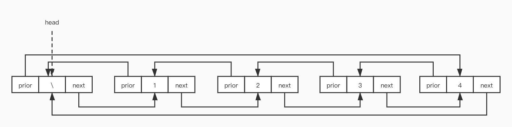

# 双向链表

## 双向链表

### 双向链表的数据结构设计


双向链表的数据结构设计和单向链表的结构差别不大，需要添加一个指针域用来指向前驱结点。

```c
typedef int Element;

typedef struct Node{
    Element data;       // 数据域
    struct Node *piror; // 前驱
    struct Node *next;  // 后继
    
} Node, *LinkList;
```

### 创建


创建双向链表步骤如下：

1. 创建头结点
2. 创建一个指针变量 `tail` 指向尾结点
3. 新建一个结点，将新建结点的 `prior` 指向 `tail`, 将 `tail->next` 指向新建的结点
4. 将 `tail` 指向新建的结点
5. 重复 3 4 步 

```c
Status CreateLinkList(LinkList *l) {
    
    if (*l) return ERROR;
    
    // 正在被创建节点的指针
    Node *p = NULL;
    // 指向尾结点的指针
    Node *tail = NULL;
    
    // 1. 创建头结点
    Node *head = (LinkList)malloc(sizeof(Node));
    if (head == NULL) return ERROR;
    head->prior = NULL;
    head->next = NULL;
    head->data = -1;
    *l = head;
    tail = head;

    printf("依次输入创建双向链表的元素,0结束输入\n");
    int a;
    while (1) {
        scanf("%d", &a);
        if (a == 0) break;
        p = (LinkList)malloc(sizeof(Node));
        if (!p) return ERROR;
        p->data = a;
        p->prior = tail;
        p->next = NULL;
        
        tail->next = p;
        tail = p;
    }
    
    return OK;
}
```

### 插入

插入结点时要考虑两种情况：

* 插入位置在链表的中间


如同所示在`结点1`和`结点2`之间插入`结点4`的步骤如下：
	
1. 将 `结点4` 的 `next` 指向 `结点2`
2. 将 `结点2` 的 `prior` 指向 `结点4`
3. 将 `结点1` 的 `next` 指向 `结点4`
4. 将 `结点4` 的 `prior` 指向 `结点1`


* 插入位置在链表的尾部


如同所示插入结点在链表的尾部。

代码如下：

```c
Status ListInsert(LinkList *l, int index, Element e) {
    
    if (*l == NULL || index < 0) return ERROR;
    
    Node *p = *l, *node = NULL;
    
    // 1. 寻找插入位置的前一个节点
    for (int i = 0; i < index; i++) {
        p = p -> next;
        if (p == NULL) {
            printf("插入位置大于链表长度\n");
            return ERROR;
        }
    }
    
    // 2. 创建插入节点
    node = (LinkList)malloc(sizeof(node));
    if (!node) return ERROR;
    node->data = e;
    node->prior = NULL;
    node->next = NULL;
    
    // 3. 插入节点
    
    // 插入位置在不是一个节点
    if (p->next != NULL) {
        // 建立插入节点和后继节点之间的关系
        node->next = p->next;
        p->next->prior = node;
    }
    // 建立插入节点和前驱节点之间的关系
    p->next = node;
    node->prior = p;
    
    return OK;
}
```

### 根据位置删除结点


根据位置阐述结点思路如下：

1. 寻找到要删除的结点
2. 如果删除的结点不是尾结点， 将删除结点的前驱的后继指向删除结点的后继， 将删除结点的后继的前驱指向删除结点的前驱
3. 如果删除的结点时尾结点， 将尾结点的前驱的后继指向 `NULL`.

代码如下：

```c
Status ListDelete(LinkList *l, int index, Element *e) {
    
    if (*l == NULL || index < 0) return ERROR;
    
    Node *p = *l;
    
    if (p->next == NULL) {
        printf("要删除的链表为空\n");
        return ERROR;
    }
    
    // 1.寻找要删除节点
    for (int i = 0; i <= index; i++) {
        p = p->next;
        if (!p) {
            // 删除位置不合法
            printf("删除位置大于链表长度\n");
            return ERROR;
        }
    }
    
    if (p->next == NULL) {
        p->prior->next = NULL;
    } else {
        p->prior->next = p->next;
        p->next->prior = p->prior;
    }
    *e = p->data;
    free(p);
    
    return ERROR;
}
```

### 根据数据删除结点

根据数据删除结点的思路和根据位置删除结点的思路大致相同，不同是寻找删除结点的方式。根据数据删除结点，首先要遍历链表对比每个结点的数据，如果相同说明找到了删除的结点。

```c
Status ListDeleteValue(LinkList *l, Element e) {
    
    if (*l == NULL) return ERROR;
    
    Node *p = (*l)->next;
    
    while (p && p->data != e) {
        p = p->next;
    }
    
    if (!p) {
        printf("没有找到查到要删除的元素");
        return ERROR;
    }
    
    if (p->next == NULL) {
        p->prior->next = NULL;
    } else {
        p->prior->next = p->next;
        p->next->prior = p->prior;
    }
    free(p);
    
    return OK;
}
```

## 双向循环链表



双向循环链表的尾结点的后继指向了头结点，头结点的前驱指向了尾结点。形成了一个闭环，因此叫做双向循环链表。

### 数据结构

双向循环链表和双向链表的数据结构相同。

```c
typedef int Element;

typedef struct Node{
    Element data;       // 数据域
    struct Node *piror; // 前驱
    struct Node *next;  // 后继
    
} Node, *LinkList;
```

### 创建

```c
// 创建双向链表
Status CreateList(LinkList *l) {
    
    // 创建头结点
    *l = (LinkList)malloc(sizeof(Node));
    if (*l == NULL) return ERROR;
    (*l)->next = *l;
    (*l)->prior = *l;
    
    // 尾结点指针
    Node *tail = *l;
    
    for (int i = 0; i < 10; i++) {
        // 创建新的结点
        Node *n = malloc(sizeof(Node));
        n->data = i;
        // 1. 尾结点的后继的前驱指向新建结点, 相当于头结点的前驱指向 n
        tail->next->prior = n; // (*l)->prior = n;
        // 2. 新建结点的后继指向尾结点的后继, 相当于n的后继指向 头结点
        n->next = tail->next; // n->next = (*l);
        // 3. 新建结点的前驱指向尾结点
        n->prior = tail;
        // 4. 尾结点的后置指向新建结点
        tail->next = n;
        // 5. 尾指针指向新建结点
        tail = n;
    }
    
    return OK;
}
```

### 插入

双向循环链表插入思路和双向链表插入思路一样，只不过不需要考虑尾结点的情况。

```c
//插入元素
Status ListInsert(LinkList *l, int index, Element e) {
    
    if (*l == NULL || index < 0) return ERROR;
    
    Node *p = (*l);
    // 寻找插入位置的前一个结点
    for (int i = 0; i < index; i++) {
        p = p->next;
        // 遍历一遍, 还没有到插入位置, 直接return
        if (p == *l) {
            printf("插入位置超过链表的长度\n");
            return ERROR;
        };
    }
    
    Node *n = malloc(sizeof(Node));
    if (!n) return ERROR;
    n->data = e;
    // 插入结点的后继指向插入结点前驱的后继
    n->next = p->next;
    // 插入结点后继的前驱指向插入结点
    p->next->prior = n;
    // 插入结点前驱的后继指向插入结点
    p->next = n;
    // 插入结点前驱指向p
    n->prior = p;
    
    return OK;
}
```

### 删除

```c
/// 删除
Status ListDelete(LinkList *l, int index, Element *e) {
    
    if (*l == NULL || index < 0) return ERROR;
    
    Node *p = *l;
    
    if (p->next == p) {
        printf("链表为空\n");
        return ERROR;
    }
    // 查找删除的元素
    for (int i = 0; i <= index; i++) {
        p = p->next;
        if (p == *l) {
            printf("删除位置超过链表长度\n");
            return ERROR;
        }
    }
    // 删除结点的前驱的后继指向删除结点的后继
    p->prior->next = p->next;
    // 删除结点的后继的前驱指向删除结点的前驱
    p->next->prior = p->prior;
    *e = p->data;
    // 释放删除结点内存
    free(p);
    return OK;
}
```
